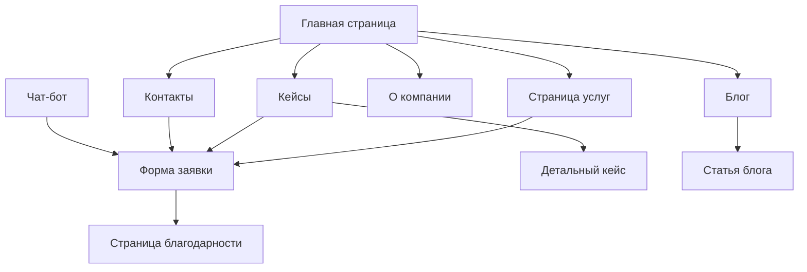

# Продуктовые требования REKLIX

## 1. Product Overview

REKLIX — агентство полного цикла для создания digital-бизнесов от продукта до трафика. Компания предоставляет комплексные решения "под ключ" и отдельные направления: реклама и программирование. Целевая аудитория — бизнес в России/СНГ (reklix.ru) и международный рынок (reklix.com) с поддержкой двух языков.

Проект решает проблему фрагментированности digital-услуг, предлагая единую экосистему для запуска и развития онлайн-бизнеса с прозрачными процессами и измеримыми результатами.

## 2. Core Features

### 2.1 User Roles

| Роль              | Метод регистрации   | Основные права                        |
| ----------------- | ------------------- | ------------------------------------- |
| Посетитель        | Без регистрации     | Просмотр контента, отправка заявок    |
| Администратор CMS | Доступ через /admin | Управление контентом, кейсами, блогом |

### 2.2 Feature Module

Наш сайт состоит из следующих основных страниц:

1. **Главная страница**: hero-секция с анимацией, 4 ключевых сервиса, 6 преимуществ, превью кейсов, процесс работы, FAQ, форма заявки
2. **Страница рекламы** (/reklama, /marketing): услуги маркетинга, подход, пакеты, кейсы, FAQ
3. **Страница программирования** (/programmirovanie, /engineering): веб-разработка, техстек, пакеты, кейсы
4. **Страница "под ключ"** (/pod-klyuch, /full-stack): комплексные решения, дорожные карты, гарантии
5. **Каталог кейсов** (/cases): фильтры, сортировка, карточки проектов
6. **Детальная страница кейса** (/cases/\[slug]): полное описание проекта с метриками
7. **Страница процесса** (/process): этапы работы, модели сотрудничества
8. **Страница цен** (/pricing): 4 пакета услуг с детализацией
9. **Блог** (/blog): статьи по категориям с rich-контентом
10. **О компании** (/about): миссия, ценности, компетенции
11. **Контакты** (/contact): форма обратной связи, соцсети
12. **Страница благодарности** (/thank-you): после отправки заявок
13. **Legal страницы** (/privacy, /cookies, /terms): юридическая информация

### 2.3 Page Details

| Страница         | Модуль           | Описание функций                                                              |
| ---------------- | ---------------- | ----------------------------------------------------------------------------- |
| Главная          | Hero-секция      | Слоган, подзаголовок, 2 CTA кнопки, премиум анимация фона                     |
| Главная          | Ключевые сервисы | 4 карточки: Реклама, Программирование, Под ключ, ИИ-модули                    |
| Главная          | Преимущества     | 6 блоков: скорость, процессы, UI/UX, производительность, аналитика, поддержка |
| Главная          | Кейсы            | 3-6 превью с логотипами, результатами, CTA "Смотреть кейс"                    |
| Главная          | Процесс          | 5 шагов: бриф → стратегия → реализация → трафик → поддержка                   |
| Главная          | FAQ              | 6-8 вопросов с аккордеон-интерфейсом                                          |
| Главная          | Форма заявки     | Имя, контакт, направление, бюджет с валидацией и антиспамом                   |
| Реклама          | Услуги           | SEO, PPC, SMM, контент, аналитика, CRM, воронки                               |
| Реклама          | Подход           | Гипотезы → спринты → метрики                                                  |
| Реклама          | Пакеты           | 3 уровня + кастомизация                                                       |
| Программирование | Услуги           | Сайты, веб-приложения, интеграции, чат-боты, ИИ-модули                        |
| Программирование | Техстек          | Next.js, Astro, Tailwind, Framer Motion, Headless CMS                         |
| Под ключ         | Включает         | Полный цикл от исследования до поддержки                                      |
| Под ключ         | Дорожные карты   | Быстрый старт 4-6 недель, типовые сроки                                       |
| Кейсы            | Каталог          | Фильтры по отрасли, типу, сервису; сортировка; плиточная сетка                |
| Кейсы            | Карточка         | Логотип, контекст, решение, метрики, галерея, стек, отзывы                    |
| Процесс          | Этапы            | 5-7 этапов с артефактами и сроками                                            |
| Процесс          | Модели           | Фикс-прайс, time\&materials, ретейнер                                         |
| Цены             | Пакеты           | Site Start, Site Pro, Growth Marketing, Full-Stack                            |
| Блог             | Категории        | Кейсы, аналитика, гайды, новости                                              |
| Блог             | Статья           | Оглавление, rich-контент, CTA "обсудить задачу"                               |
| Контакты         | Форма            | Минимум полей, валидация, SLA ответа                                          |
| Благодарности    | Контент          | Заголовок, подзаголовок, соцсети, кнопки возврата, анимация успеха            |
| Legal            | Документы        | Privacy, Cookies, Terms на RU/EN                                              |
| Хедер            | Навигация        | Логотип, меню, переключатель RU/EN, CTA "Оставить заявку"                     |
| Футер            | Контент          | Краткий оффер, дубль меню, соцсети, legal, копирайт                           |

## 3. Core Process

### Основной пользовательский поток:

1. **Посетитель заходит на сайт** → просматривает главную страницу → изучает услуги
2. **Выбор направления** → переходит на страницу конкретной услуги (Реклама/Программирование/Под ключ)
3. **Изучение кейсов** → просматривает портфолио и результаты работ
4. **Принятие решения** → заполняет форму заявки или использует чат-бот
5. **Получение обратной связи** → перенаправление на страницу благодарности

### Административный поток:

1. **Администратор входит в CMS** → управляет контентом через /admin
2. **Добавление кейсов** → создает новые проекты с метриками
3. **Публикация статей** → ведет блог с категоризацией
4. **Обновление цен** → корректирует пакеты услуг

## 4. User Interface Design

### 4.1 Design Style

* **Основные цвета**: тёмный графит (#1a1a1a), слоновая кость (#faf9f6)

* **Акцентный цвет**: электрик-синий (#0066ff) или неоновый лайм (#39ff14)

* **Стиль кнопок**: современные с закругленными углами, hover-эффекты

* **Шрифты**: Inter/Manrope для заголовков и текста, font-display: swap

* **Размеры шрифтов**: крупные заголовки (48-64px), средний текст (16-18px)

* **Стиль макета**: много воздуха, строгая типографика, чёткая иерархия

* **Иконки**: Lucide, минималистичный стиль

* **Анимации**: Framer Motion, 200-400ms, мягкие переходы

### 4.2 Page Design Overview

| Страница | Модуль       | UI Элементы                                                              |
| -------- | ------------ | ------------------------------------------------------------------------ |
| Главная  | Hero         | Крупный заголовок, градиентный фон, 2 CTA кнопки, анимированные элементы |
| Главная  | Сервисы      | 4 карточки в сетке 2x2, иконки, hover-эффекты                            |
| Главная  | Преимущества | 6 блоков в сетке 3x2, иконки, краткие описания                           |
| Главная  | Кейсы        | Карусель или сетка, превью изображения, метрики, CTA кнопки              |
| Главная  | Процесс      | Горизонтальная временная шкала с иконками этапов                         |
| Главная  | FAQ          | Аккордеон с анимацией раскрытия                                          |
| Главная  | Форма        | Компактная форма с валидацией, современные инпуты                        |
| Кейсы    | Каталог      | Фильтры сверху, карточки в сетке, пагинация                              |
| Кейсы    | Детальная    | Полноэкранные изображения, метрики в карточках, галерея                  |
| Блог     | Список       | Карточки статей с превью, теги, дата публикации                          |
| Блог     | Статья       | Широкая колонка текста, оглавление сбоку, CTA блоки                      |
| Хедер    | Навигация    | Горизонтальное меню, переключатель языка, CTA кнопка                     |
| Футер    | Контент      | 4 колонки: оффер, меню, соцсети, legal                                   |

### 4.3 Responsiveness

Сайт адаптивный с приоритетом desktop-first, оптимизирован для мобильных устройств от 360px до 1440px+. Включает touch-оптимизацию для мобильных устройств, адаптивную типографику и гибкие сетки.

## 5. Technical Requirements

### 5.1 Темы оформления

* Автоматическое переключение день/ночь по системным настройкам

* Ручное переключение темы с сохранением в localStorage

* Плавные переходы между темами

### 5.2 Интернационализация

* Поддержка RU/EN языков

* Переключатель языка в хедере

* Hreflang теги для SEO

* Локализованные URL (например: /reklama vs /marketing)

### 5.3 Формы и чат-бот

* Интеграция с Crisp для чат-бота

* Формы без backend через Formspree/Getform

* Валидация на фронтенде

* Антиспам защита (honeypot + таймер)

* Отправка в Telegram + email

### 5.4 CMS и контент

* Decap CMS для управления контентом

* Git-based хранение в Markdown/JSON

* Админ-панель через /admin

* Двуязычный контент

### 5.5 Аналитика

* Google Analytics 4

* Яндекс.Метрика

* Пиксели Meta/LinkedIn/X

* Cookie-баннер Klaro

* Отслеживание событий: формы, клики, просмотры

