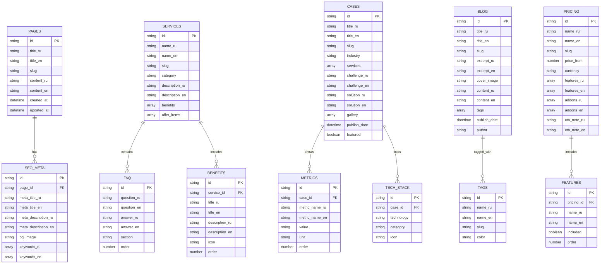

# Техническая архитектура REKLIX

## 1. Architecture design


## 2. Technology Description

* **Frontend**: Next.js\@14 + React\@18 + TypeScript + Tailwind CSS\@3 + Framer Motion\@10

* **Build Tool**: Vite (через Next.js)

* **CMS**: Decap CMS (Git-based)

* **Forms**: Formspree/Getform (external service)

* **Chat**: Crisp widget

* **Analytics**: Google Analytics 4 + Yandex Metrica

* **Icons**: Lucide React

* **Deployment**: GitHub Actions + reg.ru static hosting

* **Internationalization**: next-intl

## 3. Route definitions

| Route                           | Purpose                                          |
| ------------------------------- | ------------------------------------------------ |
| /                               | Главная страница с hero, сервисами, кейсами, FAQ |
| /reklama, /marketing            | Страница рекламных услуг                         |
| /programmirovanie, /engineering | Страница услуг программирования                  |
| /pod-klyuch, /full-stack        | Страница комплексных решений                     |
| /cases                          | Каталог кейсов с фильтрацией                     |
| /cases/\[slug]                  | Детальная страница кейса                         |
| /process                        | Описание процесса работы                         |
| /pricing                        | Пакеты и цены                                    |
| /blog                           | Список статей блога                              |
| /blog/\[slug]                   | Детальная страница статьи                        |
| /about                          | О компании                                       |
| /contact                        | Контакты и форма обратной связи                  |
| /thank-you                      | Страница благодарности после заявки              |
| /privacy                        | Политика конфиденциальности                      |
| /cookies                        | Политика использования cookies                   |
| /terms                          | Пользовательское соглашение                      |
| /admin                          | Админ-панель Decap CMS                           |

## 4. API definitions

### 4.1 Core API

**Отправка формы заявки**

```
POST /api/contact (через Formspree/Getform)
```

Request:

| Param Name | Param Type | isRequired | Description                |
| ---------- | ---------- | ---------- | -------------------------- |
| name       | string     | true       | Имя клиента                |
| contact    | string     | true       | Telegram @handle или email |
| service    | string     | true       | Интересующее направление   |
| budget     | string     | true       | Бюджетная вилка            |
| message    | string     | false      | Дополнительное сообщение   |
| \_honeypot | string     | false      | Скрытое поле для антиспама |

Response:

| Param Name | Param Type | Description            |
| ---------- | ---------- | ---------------------- |
| success    | boolean    | Статус отправки        |
| message    | string     | Сообщение о результате |

Example:

```json
{
  "name": "Иван Петров",
  "contact": "@ivan_petrov",
  "service": "Программирование",
  "budget": "$5k-10k",
  "message": "Нужен корпоративный сайт"
}
```

**Подписка на рассылку**

```
POST /api/newsletter
```

Request:

| Param Name | Param Type | isRequired | Description        |
| ---------- | ---------- | ---------- | ------------------ |
| email      | string     | true       | Email для подписки |

**Отправка сообщения через чат-бот**

```
POST /api/chat (через Crisp webhook)
```

Request:

| Param Name | Param Type | isRequired | Description         |
| ---------- | ---------- | ---------- | ------------------- |
| name       | string     | true       | Имя пользователя    |
| contact    | string     | true       | Контактные данные   |
| service    | string     | true       | Интересующая услуга |
| budget     | string     | true       | Бюджет проекта      |
| deadline   | string     | false      | Желаемые сроки      |

## 5. Server architecture diagram


## 6. Data model

### 6.1 Data model definition



### 6.2 Data Definition Language

**Decap CMS Configuration (config.yml)**

```yaml
backend:
  name: git-gateway
  branch: main

media_folder: "public/images/uploads"
public_folder: "/images/uploads"

locale: 'ru'
i18n:
  structure: multiple_files
  locales: [ru, en]
  default_locale: ru

collections:
  - name: "pages"
    label: "Страницы"
    folder: "content/pages"
    create: true
    slug: "{{slug}}"
    i18n: true
    fields:
      - {label: "Заголовок", name: "title", widget: "string", i18n: true}
      - {label: "Слаг", name: "slug", widget: "string"}
      - {label: "Контент", name: "body", widget: "markdown", i18n: true}
      - {label: "SEO Заголовок", name: "seo_title", widget: "string", i18n: true, required: false}
      - {label: "SEO Описание", name: "seo_description", widget: "text", i18n: true, required: false}
      - {label: "Дата создания", name: "date", widget: "datetime"}

  - name: "services"
    label: "Услуги"
    folder: "content/services"
    create: true
    slug: "{{slug}}"
    i18n: true
    fields:
      - {label: "Название", name: "title", widget: "string", i18n: true}
      - {label: "Слаг", name: "slug", widget: "string"}
      - {label: "Категория", name: "category", widget: "select", options: ["marketing", "engineering", "full-stack"]}
      - {label: "Описание", name: "description", widget: "text", i18n: true}
      - {label: "Преимущества", name: "benefits", widget: "list", i18n: true, fields: [
          {label: "Заголовок", name: "title", widget: "string"},
          {label: "Описание", name: "description", widget: "text"},
          {label: "Иконка", name: "icon", widget: "string"}
        ]}
      - {label: "Предложения", name: "offers", widget: "list", i18n: true, fields: [
          {label: "Название", name: "name", widget: "string"},
          {label: "Описание", name: "description", widget: "text"}
        ]}
      - {label: "FAQ", name: "faq", widget: "list", i18n: true, fields: [
          {label: "Вопрос", name: "question", widget: "string"},
          {label: "Ответ", name: "answer", widget: "text"}
        ]}

  - name: "cases"
    label: "Кейсы"
    folder: "content/cases"
    create: true
    slug: "{{slug}}"
    i18n: true
    fields:
      - {label: "Название", name: "title", widget: "string", i18n: true}
      - {label: "Слаг", name: "slug", widget: "string"}
      - {label: "Отрасль", name: "industry", widget: "string", i18n: true}
      - {label: "Услуги", name: "services", widget: "list", field: {label: "Услуга", name: "service", widget: "string"}}
      - {label: "Вызов", name: "challenge", widget: "text", i18n: true}
      - {label: "Решение", name: "solution", widget: "text", i18n: true}
      - {label: "Результаты", name: "results", widget: "list", fields: [
          {label: "Метрика", name: "metric", widget: "string", i18n: true},
          {label: "Значение", name: "value", widget: "string"},
          {label: "Единица", name: "unit", widget: "string", i18n: true}
        ]}
      - {label: "Галерея", name: "gallery", widget: "list", field: {label: "Изображение", name: "image", widget: "image"}}
      - {label: "Технологии", name: "tech_stack", widget: "list", field: {label: "Технология", name: "tech", widget: "string"}}
      - {label: "Дата публикации", name: "publish_date", widget: "datetime"}
      - {label: "Рекомендуемый", name: "featured", widget: "boolean", default: false}

  - name: "blog"
    label: "Блог"
    folder: "content/blog"
    create: true
    slug: "{{year}}-{{month}}-{{day}}-{{slug}}"
    i18n: true
    fields:
      - {label: "Заголовок", name: "title", widget: "string", i18n: true}
      - {label: "Слаг", name: "slug", widget: "string"}
      - {label: "Краткое описание", name: "excerpt", widget: "text", i18n: true}
      - {label: "Обложка", name: "cover", widget: "image"}
      - {label: "Контент", name: "body", widget: "markdown", i18n: true}
      - {label: "Теги", name: "tags", widget: "list", field: {label: "Тег", name: "tag", widget: "string"}}
      - {label: "Автор", name: "author", widget: "string"}
      - {label: "Дата публикации", name: "publish_date", widget: "datetime"}

  - name: "pricing"
    label: "Цены"
    folder: "content/pricing"
    create: true
    slug: "{{slug}}"
    i18n: true
    fields:
      - {label: "Название", name: "name", widget: "string", i18n: true}
      - {label: "Слаг", name: "slug", widget: "string"}
      - {label: "Цена от", name: "price_from", widget: "number"}
      - {label: "Валюта", name: "currency", widget: "select", options: ["USD", "EUR", "RUB"]}
      - {label: "Особенности", name: "features", widget: "list", i18n: true, field: {label: "Особенность", name: "feature", widget: "string"}}
      - {label: "Дополнения", name: "addons", widget: "list", i18n: true, fields: [
          {label: "Название", name: "name", widget: "string"},
          {label: "Цена", name: "price", widget: "number"}
        ]}
      - {label: "CTA Заметка", name: "cta_note", widget: "string", i18n: true, required: false}

  - name: "settings"
    label: "Настройки"
    files:
      - label: "Общие настройки"
        name: "general"
        file: "content/settings/general.yml"
        fields:
          - {label: "Название сайта", name: "site_title", widget: "string", i18n: true}
          - {label: "Описание сайта", name: "site_description", widget: "text", i18n: true}
          - {label: "Контакты", name: "contacts", widget: "object", fields: [
              {label: "Email", name: "email", widget: "string"},
              {label: "Telegram", name: "telegram", widget: "string"},
              {label: "Телефон", name: "phone", widget: "string"}
            ]}
          - {label: "Социальные сети", name: "social", widget: "object", fields: [
              {label: "Instagram", name: "instagram", widget: "string"},
              {label: "Facebook", name: "facebook", widget: "string"},
              {label: "VK", name: "vk", widget: "string"},
              {label: "Telegram", name: "telegram", widget: "string"},
              {label: "LinkedIn", name: "linkedin", widget: "string"},
              {label: "X (Twitter)", name: "x", widget: "string"}
            ]}
          - {label: "Аналитика", name: "analytics", widget: "object", fields: [
              {label: "Google Analytics ID", name: "ga_id", widget: "string"},
              {label: "Yandex Metrica ID", name: "ym_id", widget: "string"}
            ]}
```

**Структура файлов контента**

```
content/
├── pages/
│   ├── about.ru.md
│   ├── about.en.md
│   ├── process.ru.md
│   └── process.en.md
├── services/
│   ├── marketing.ru.md
│   ├── marketing.en.md
│   ├── engineering.ru.md
│   ├── engineering.en.md
│   ├── full-stack.ru.md
│   └── full-stack.en.md
├── cases/
│   ├── case-1.ru.md
│   ├── case-1.en.md
│   └── ...
├── blog/
│   ├── 2024-01-15-article-1.ru.md
│   ├── 2024-01-15-article-1.en.md
│   └── ...
├── pricing/
│   ├── site-start.ru.md
│   ├── site-start.en.md
│   └── ...
└── settings/
    └── general.yml
```

## 7. Performance & SEO Optimization

### 7.1 Core Web Vitals

* **LCP**: < 2.5s через оптимизацию изображений и критического CSS

* **INP**: < 200ms через оптимизацию JavaScript

* **CLS**: < 0.1 через фиксированные размеры элементов

### 7.2 SEO Features

* Автогенерация sitemap.xml и robots.txt

* Schema.org разметка (Organization, WebSite, Service, FAQPage, Article)

* Hreflang теги для мультиязычности

* OpenGraph и Twitter Cards

* Каноникальные URL

* Оптимизированные мета-теги

### 7.3 Image Optimization

* Next.js Image компонент с автоматической оптимизацией

* Поддержка AVIF/WebP форматов

* Lazy loading для изображений

* Responsive images с srcset

### 7.4 Bundle Optimization

* Code splitting по страницам

* Tree shaking неиспользуемого кода

* Минификация CSS и JavaScript

* Gzip/Brotli сжатие

* <br />

